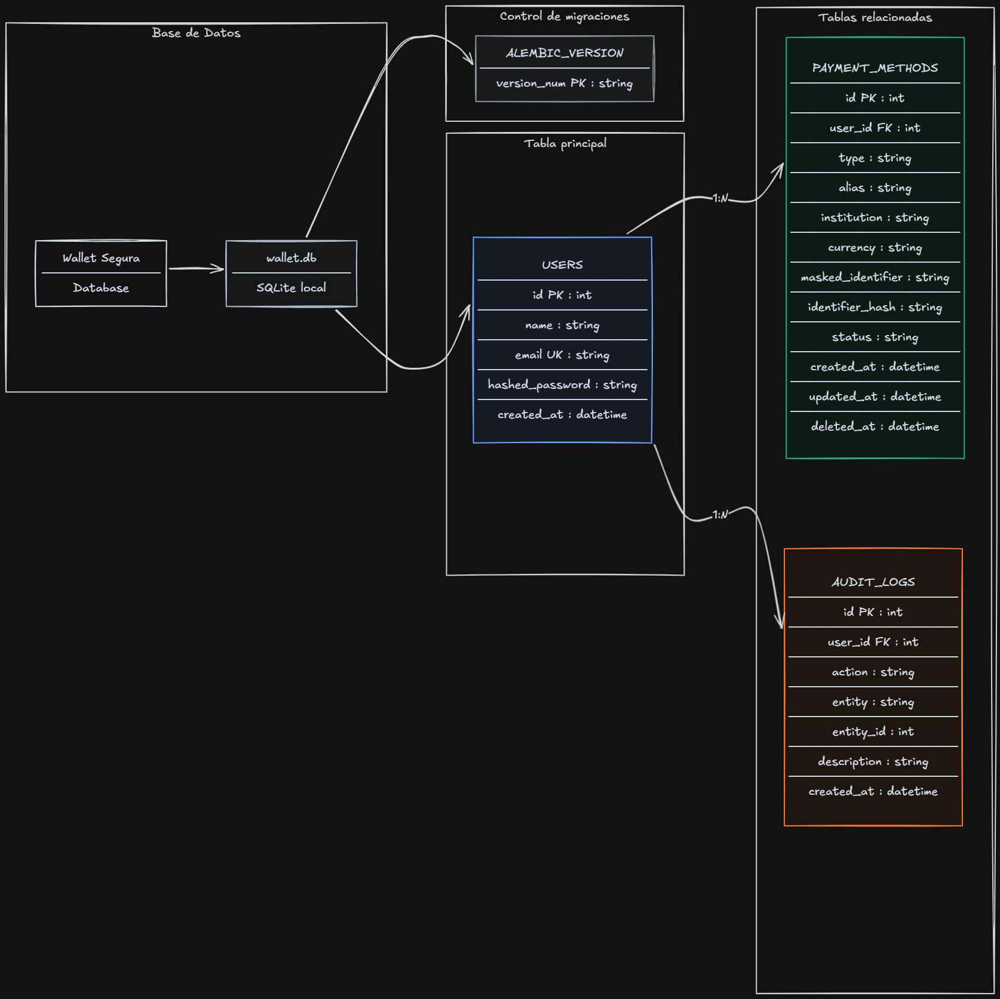
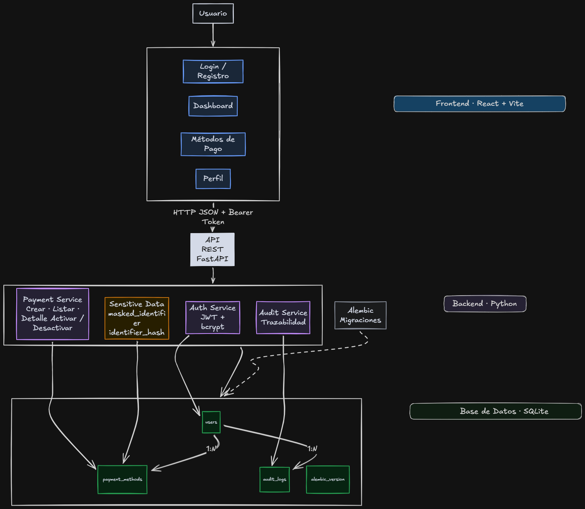

# Arquitectura del proyecto

## Diagrama de Arquitectura y Base de Datos







## Flujo de autenticación

1. El usuario se registra con nombre, email y contraseña.
2. El backend valida que el email no exista.
3. La contraseña se hashea con bcrypt.
4. El usuario inicia sesión con email y contraseña.
5. El backend valida las credenciales.
6. Si son correctas, genera un JWT.
7. El frontend guarda el token en `localStorage`.
8. En cada petición privada, el frontend envía:

```txt
Authorization: Bearer <token>
```

9. El backend valida el token y obtiene el usuario autenticado.

## Manejo de datos sensibles

El identificador completo del método de pago no se guarda ni se muestra.

Cuando el usuario registra un método de pago:

1. Se normaliza el identificador.
2. Se genera `masked_identifier` mostrando solo los últimos 4 caracteres.
3. Se genera `identifier_hash` usando HMAC-SHA256 con una clave privada.
4. Se compara `identifier_hash` para prevenir duplicados por usuario.
5. En frontend solo se muestra un valor como:

```txt
**** **** **** 1234
```

Esto permite identificar visualmente el método sin exponer información sensible.

## Activación y desactivación de métodos

Los métodos de pago no se eliminan físicamente.

El frontend puede cambiar su estado usando:

```http
PATCH /api/payment-methods/{id}/status
```

Ejemplo para desactivar:

```json
{
  "status": "inactive"
}
```

Ejemplo para activar:

```json
{
  "status": "active"
}
```

Cuando el método queda inactivo:

- `status` cambia a `inactive`.
- `deleted_at` recibe la fecha actual.
- Se registra un evento en `audit_logs`.

Cuando el método se reactiva:

- `status` cambia a `active`.
- `deleted_at` vuelve a `null`.
- Se registra un evento en `audit_logs`.

## Trazabilidad

La tabla `audit_logs` registra operaciones importantes:

- Registro de usuario.
- Login exitoso.
- Creación de método de pago.
- Consulta de detalle.
- Activación de método de pago.
- Desactivación de método de pago.

Campos principales:

```txt
id
user_id
action
entity
entity_id
description
created_at
```

La auditoría ayuda a revisar actividad del usuario.
